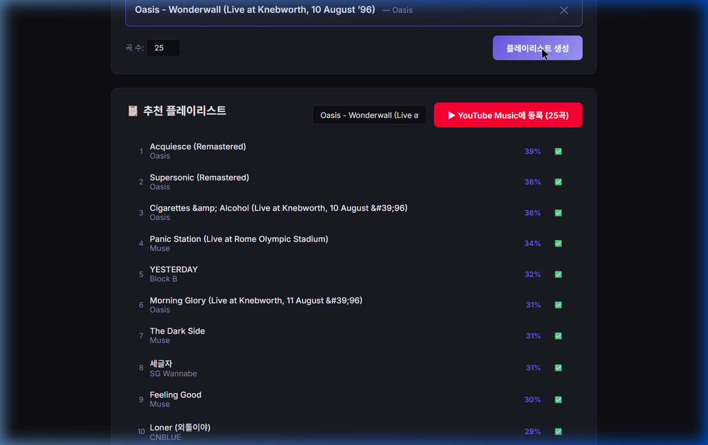

# 내 청취 기록으로 만든 음악 추천 엔진

내 유튜브 뮤직 청취 기록(2만 건, 18개월)으로 만든 개인 추천기입니다. 시드곡 하나를 고르면 그에 어울리는 플레이리스트를 만들어 줍니다.

**왜 만들었나.** 저는 음악을 무척 좋아해서 많이 듣고, 그만큼 청취한 곡도 많은 편입니다. 그런데 기존 유튜브 뮤직을 쓰면서 한 가지가 계속 아쉬웠습니다 — **어지간히 들어서 이제는 슬슬 질린 곡인데도 계속 추천해 주는** 것이었어요. 스킵을 해서 "이제 질렸다"고 티를 내도 아랑곳하지 않고 또 띄웠습니다. 마치 *내가 이 곡을 지금 얼마나 좋아하는지(호감도)를 재는 데에는 별 관심이 없는* 것처럼요. 그래서 **사용자의 호감도를 제대로 잴 수 있는 추천 알고리즘**을 직접 만들어 보고 싶었습니다.

다만 이 저장소에서 보여드리고 싶은 건 추천기 자체보다, **내 청취에 대한 가설을 세우고 → 내 데이터로 엄밀히 검증하고 → 결과에 따라 결론을 고쳐 간 과정**입니다. 저장소 이름이 `lifecycle-based`인 것이 그 흔적입니다. 저는 "노래에는 생애주기(질리는 흐름)가 있고, 그걸 추천에 쓸 수 있다"는 믿음으로 시작했습니다. 검증해보니 **생애주기는 실재했고, 놀랄 만큼 보편적이었습니다 — 그것도 서로 다른 두 가지 방법으로 똑같이 확인됐습니다.** 그런데 그 보편성을 미래 예측에 쓰려 하면 두 갈래로 갈렸습니다. *"이 곡에 **언제** 질릴지"*는 원리적으로 미리 맞힐 수 없었고, 대신 *"지금 이 곡이 식는 중인가"*는 맞힐 수 있었습니다. 그래서 추천기는 *내가 원래 사랑하는 정도(진폭)*와 *지금의 행동(현재 강도)*을 함께 겨냥하는 형태로 남았습니다. 이 발견과, 결론을 깎고 고쳐 *도달한* 과정이 함께 담겨 있습니다.

---

## 1. 문제를 어떻게 쪼갰나

"지금 이 곡을 추천해도 될까?"라는 질문에는 사실 **서로 다른 세 가지 판단**이 섞여 있다고 봤습니다.

| 판단 | 질문 | 이름 |
|---|---|---|
| ① 어울리나 | 지금 고른 시드곡의 결과 맞나? | **유사도** |
| ② 좋아하나 | 내가 *원래* 이 곡을 사랑하나? | **진폭** |
| ③ 지금인가 | 지금이 이 곡을 들을 때인가? | **현재 강도** |

처음에는 ②와 ③을 독립적인 신호로 보고 각각 만들려 했고, 특히 ③(생애주기·질림)에서 "지금 이 곡이 생애 곡선의 어디쯤인지" 같은 정교한 신호를 뽑아내려 했습니다. 그런데 검증해보니 ③은 두 조각으로 갈렸습니다 — **언제 질릴지(시점)는 원리적으로 예측이 막혔지만, 지금 얼마나 듣고 있나(현재 강도)는 살아남아** ②와 함께 추천에 들어갔습니다(3장). 그래서 최종 점수는 이렇게 정리됩니다:

> **추천 점수 = 유사도 × (진폭<sup>α</sup> × 현재 강도<sup>β</sup>)**

3장이 이 저장소의 핵심입니다 — *정교한 ③ 가설을 세우고, 여러 방식으로 검증해 무엇이 살아남고 무엇이 무너지는지 가른 뒤, 추천에 실제로 쓸 신호를 정직하게 추려낸 과정*입니다.

---

## 2. 진폭 — "이 곡을 원래 얼마나 사랑하나"

**정답지.** 곡 118개를 직접 1~5점으로 평가했습니다. 이게 모델이 맞혀야 할 목표값입니다.

**왜 LightGBM인가.** 정답지가 ~118곡으로 적고, 입력은 곡마다 정리된 표 형태의 수치입니다. 이런 *작고 표 형태인 데이터*에서는 딥러닝은 과적합하기 쉽고, 단순 선형회귀는 피처 간 상호작용(예: "같은 행동이라도 *어떤 아티스트*냐에 따라 의미가 다르다")을 못 잡습니다. **그래디언트 부스팅 트리(LightGBM)**는 적은 데이터에서도 상호작용을 잡으면서 정규화로 과적합을 누를 수 있어 골랐습니다.

**어떤 피처를, 왜 넣었나.** 설계 원칙은 *드러난 선호(revealed preference)*, 특히 **'일부러 골랐다'는 신호**입니다. 저는 스킵을 거의 안 하고 매번 직접 골라 듣는 큐레이터형이라, 의도적 선택이 호감도를 가장 깨끗이 드러냅니다. 곡마다 다음을 집계해 입력했습니다(괄호 안이 정확한 정의):

- **완주 재생수** — 그 곡을 *스킵 없이 끝까지 들은 재생의 수*. (단순히 튼 횟수가 아니라 스킵한 재생은 뺀 '제대로 들은 횟수'.)
- **완주율 · 즉시 스킵률 · 샘플 스킵률** — 한 재생을 *얼마나 들었나*는 그 재생과 *바로 다음 재생* 사이의 시간 간격으로 추정합니다. 간격이 **10초 이하 = 즉시 스킵**(인트로도 안 듣고 넘김), **10~30초 = 샘플 스킵**(들어보고 넘김), **30초 초과 = 완주**(정상 감상; 30초는 스트리밍 업계에서 '한 번 재생'으로 인정하는 기준). *완주율* = 그 곡 재생 중 완주의 비율(= 스킵 안 한 비율), 즉시·샘플 스킵률도 같은 식.
- **검색해 들은 비율** — 별도의 *검색 기록*(Takeout)을 활용합니다. 한 재생의 **직전 10분** 안에 그 곡의 아티스트·제목과 맞는 검색이 있었으면 그 재생을 "검색해 들음"으로 표시하고, 곡별로 그 비율을 씁니다.
- **세션 첫 곡 비율** — **직전 곡과 30분 이상 공백이 있은 뒤의 첫 곡**을 '세션 시작곡'으로 봅니다(새 청취 세션을 *이 곡으로 열었다* = 검색만큼 의도적). 곡별로 세션을 연 재생의 비율.
- **아티스트 평균 점수** — 제 평점이 아티스트 단위로 일관돼, "그 아티스트의 *다른* 곡들에 매긴 점수의 평균"을 피처로 씁니다(맞히려는 곡 자신은 빼고 — 누수 방지). 그런데 제가 평가한 건 118곡(20여 아티스트)뿐이라, 라이브러리의 나머지 아티스트는 이 값이 비어버립니다(전체 곡의 **41%**가 그렇습니다). 그래서 **2단계**로 채웁니다: ① 먼저 모델로 *안 매긴 곡들의 점수도 예측*하고, ② 아티스트 평균을 "내가 매긴 점수 + 안 매긴 곡의 예측 점수"로 계산합니다. 한 번도 평가하지 않은 아티스트의 곡에도 아티스트 신호가 생깁니다. (이렇게 *라벨 있는 곡 + 라벨 없는 곡을 함께 쓰는* 방식을 **준지도 학습(semi-supervised)**이라 합니다.)

> 참고 1: 위 행동 피처와 함께, 곡의 *음색을 요약한 오디오 특성*도 입력으로 넣었습니다(넣었을 때 정확도가 올라 채택).
>
> 참고 2: **recency(최근에 얼마나 듣고 있나)는 진폭에 일부러 넣지 않았습니다.** recency는 '지금의 행동'(3장에서 다룰 *현재 강도*)이지 '원래 이 곡을 사랑하는 정도'가 아니라서, 두 신호를 섞어버리면 안 되기 때문입니다. 진폭과 현재 강도를 깨끗이 분리해 둔 덕분에, 나중에(3-5) 둘을 추천 점수에서 함께 써도 *이중 계산*이 되지 않습니다.

**정확도를 어떻게 쟀나 (반복 5-겹 교차검증).** 같은 곡으로 학습·시험하면 답을 외워 가짜로 높아지므로, 라벨곡을 5묶음으로 나눠 **4묶음으로 학습하고 *학습에 안 쓴* 나머지 1묶음의 점수를 예측**합니다. 묶음을 돌려가며 5번 → 모든 곡이 "안 본 상태"로 예측됩니다. 그 예측과 실제 평점의 **피어슨 상관 r**을 계산하고, 나누는 방식의 우연을 줄이려 전체를 10번 반복해 평균냈습니다. (아티스트 평균 점수는 매 폴드의 *학습 곡만으로* 계산해 누수를 막았습니다.) → **r ≈ 0.64.**

### 2-1. 정답지의 함정 — 두 정답지가 다른 성능을 낸 이유

**4월에 곡들의 호감도를 손으로 매긴 정답지가 있었고, 6월에 한 번 더 매겼습니다.** 이 두 정답지로 *각각* 같은 모델(같은 피처·같은 교차검증)을 학습시켜 두 모델을 만들고 성능을 비교했습니다.

- **4월 정답지(118곡)로 만든 모델**: r ≈ **0.64**
- **6월 정답지(187곡)로 만든 모델**: r ≈ **0.73**

6월이 꽤 더 좋았습니다. 이상했습니다 — 모델도 방식도 똑같고 *정답지만* 바꿨는데요. 그래서 둘이 어떻게 다른지 파고들었습니다.

1. **곡 구성 탓인가?** 두 정답지에 *공통으로 있는 118곡*만 떼어, 같은 곡들을 4월 점수로 / 6월 점수로 각각 예측했습니다 → 6월이 여전히 이겼습니다(0.72 vs 0.64). 곡 수·구성 문제가 아니라 **라벨 자체의 차이**입니다.
2. **라벨이 어떻게 다른가?** "한 아티스트의 곡들에 얼마나 비슷한 점수를 줬나"를 **eta²**(아티스트가 점수 분산을 설명하는 비율)로 쟀습니다 → 6월 **0.56**, 4월 **0.38**. 즉 6월엔 곡별 차이를 덜 두고 **아티스트 단위로 비슷한 점수**를 줬습니다.

이 둘을 이해한 상태에서 제가 내린 판단은 이렇습니다 — **6월엔 (그 무렵 음악을 덜 들어서) 곡 하나하나를 음미하지 못하고 아티스트 이미지로 뭉뚱그려 채점했고, 곡마다 섬세히 매긴 4월 점수가 내 진짜 호감도에 더 가깝다.** 그리고 6월 모델의 r이 높았던 건 *라벨이 더 정확해서*가 아니라, 이 모델의 가장 강한 피처가 아티스트라서 *아티스트로 뭉개진 라벨을 더 쉽게 맞혔기* 때문입니다.

> **남은 검증의 한계.** 위 (1)·(2)로 "곡 구성 탓 아님 + 아티스트로 뭉갬"까지는 데이터로 보였지만, *"4월이 실제로 더 진심에 가깝다"*는 마지막 한 걸음은 행동 데이터만으론 완전 증명이 어렵습니다(곡별로 섬세히 매겼다는 제 청취 맥락에 기댐). 이 한계는 인정합니다.

> **배운 점: 검증 지표가 높다고 더 옳은 정답지인 것은 아니다.** 모델이 기대는 구조(여기선 아티스트)와 라벨이 우연히 맞물리면 *덜 정확한 라벨이 더 높은 점수*를 냅니다. 그래서 점수가 더 잘 나오는 6월이 아니라 **4월 정답지**를 채택했습니다.

---

## 3. 생애주기 — 무엇이 검증됐고, 추천엔 무엇을 쓰나 (핵심)

이 장은 세 단계로 흘러갑니다. 먼저 "노래는 식어간다, 그리고 그 식는 *모양*이 곡마다 똑같다"는 것을 **두 가지 독립적인 방법으로** 검증합니다(3-1, 3-2). 다음으로 그 보편성을 미래 예측에 쓰려 할 때 *무엇이 되고 무엇이 안 되는지*를 가릅니다(3-3, 3-4). 마지막으로, 그 결과를 보고 제가 한 번 잘못 내렸던 결론을 스스로 바로잡아 최종 추천 공식에 도달합니다(3-5).

### 3-1. '질림'을 무엇으로 측정할 것인가

먼저 정의부터 정해야 했습니다. "질린다"를 데이터에서 잡는 흔한 방법은 *스킵*(틀었다 빨리 넘김)인데, **저에겐 잘 안 맞습니다.** 저는 추천에 맡기기보다 **듣고 싶은 곡을 직접 골라 듣는 편이 많아서**(물론 셔플도 씁니다), 마음에 안 들어 스킵하는 일 자체가 드뭅니다(실제로 스킵 기반 신호는 평평했습니다). 명시적 별점도 잘 안 변했고요. (직접 고르는 편이 많은 만큼, 추천기는 *일일이 고르기 번거로울 때 틀어둘 좋은 자동 재생목록*을 만들어 주는 역할입니다.)

그래서 **제 청취 방식에 맞는 정의**를 택했습니다:

> **질림 = 그 곡을 *다시 고르기까지의 간격*이 점점 벌어지는 것.**

직접 고르는 사람에게는 "언제 또 고르나"의 간격이 곧 마음이기 때문입니다.

**조작적 정의와 측정.** 각 곡의 재생을 시간순으로 1, 2, 3…번째로 놓고, 연속한 두 재생 사이의 **간격**을 셉니다 — 그 사이에 내가 *다른 곡을 포함해* 몇 번 재생했나(*날짜*가 아니라 *재생 횟수*로 셈. 한동안 음악을 아예 안 들으면 모든 곡의 날짜 간격이 같이 벌어져 가짜 질림이 되므로). 그리고 **'몇 번째 재생인가'와 '그때의 간격' 사이의 스피어만 순위상관**을 구합니다. 양수면 *뒤 재생일수록 간격이 큼 = 식는 중*입니다.

→ 재생 8회 이상인 곡의 81%가 그랬습니다. 다만 *"시간이 지나면 덜 듣는다"* 자체는 당연한 얘기입니다. **흥미로운 진짜 질문은 따로 있습니다 — 그 식어가는 *모양*이 곡마다 똑같은가?** (3-2)

### 3-2. 식어가는 '모양'은 곡을 가로질러 보편적인가 — 두 방법으로 검증

곡마다 *얼마나 깊이·얼마나 오래* 빠지는지는 달라도, *시간에 따라 식어가는 패턴(모양)*은 같을까요? 이건 추천 설계의 근거가 될 만큼 중요한 주장이라, **서로 약점이 다른 두 가지 방법으로 따로 검증**했습니다. 두 방법이 같은 결론을 가리켜야 비로소 믿을 수 있으니까요.

#### 방법 1 — 날짜를 0~1로 '뭉갠' 버전 (정규화 함수형 PCA)

**무슨 곡선을 그렸나.** 재생 16회 이상인 곡마다 **누적 소비 곡선**을 그립니다. 가로축 x는 그 곡의 생애(첫 재생 ~ 마지막 재생)를 **0~1로 정규화한 시점**, 세로축 y는 *그 시점까지 그 곡 재생의 누적 비율*입니다. 고르게 들었으면 대각선, 초반에 몰아듣고 식었으면 대각선 위로 볼록한 곡선이 됩니다. 각 곡선을 21개 점으로 표본화해 (곡 × 21) 행렬로 쌓았습니다.

**무슨 계산을 했나.** 이 행렬에 **주성분분석(곡선에 적용하므로 함수형 PCA)**을 적용해, **제1주성분이 곡 간 분산의 몇 %를 설명하는지**를 봤습니다. 만약 곡선들이 *하나의 공통 모양에 세기(진폭)만 다른* 것이라면, 단 한 개의 성분이 차이의 대부분을 설명할 것입니다.

**결과와, 그게 우연이 아님을 어떻게 보였나.**
- 제1주성분 = **83%** — 곡 간 차이의 83%가 단 하나의 축("얼마나 초반에 몰입하나")으로 설명됩니다.
- *질림이 없다면 이 값이 얼마나 나올까?* 를 알아야 83%가 큰지 판단할 수 있습니다. 그래서 **귀무모형**을 만들었습니다 — 곡별 재생 횟수는 실제와 똑같이 두고, *재생 시점만 생애에 무작위로 흩뿌린* 가상의 데이터입니다. 여기에 같은 분석을 돌리면 제1주성분 = **61%**가 나옵니다. (누적 곡선이 양 끝점 (0,0)·(1,1)에 묶여 있어 구조적으로 나오는 값으로, 이론적으로 브라운 다리(Brownian bridge)의 첫 성분 6/π² ≈ 0.61과 일치합니다 — 검산도 했습니다.)
- 실제 83%는 이 귀무 분포에서 **약 11σ 위**입니다. 우연으로 나올 수 없는 값입니다.
- 평균 곡선은 **생애 첫 25% 시점에 이미 재생의 42%**에 도달합니다(무작위라면 25%). "초반에 확 빠졌다가 길게 식는" 모양이 실재함을 보여줍니다.
- 이 결과는 **다른 사용자 7명 전원**에서 재현됐습니다(초반 몰입 0.40~0.44).

#### 방법 2 — 날짜를 '살린' 버전 (절대 시간 점과정 모형)

방법 1에는 한 가지 약점이 있습니다. x축을 0~1로 정규화할 때 **분모가 '마지막 재생일'**인데, 마지막 재생일은 *미래에 일어나는 사건*입니다. 즉 곡선을 그리려면 "이 곡을 언제 마지막으로 듣는지"를 이미 알아야 합니다(이걸 look-ahead, 미리보기 누수라 합니다). 보편성을 *기술하는* 데는 문제가 없지만, 의심을 없애려면 **미래를 쓰지 않고도** 같은 결론이 나오는지 확인해야 합니다.

그래서 날짜를 0~1로 줄이지 않고 **절대 시간(첫 재생 후 며칠) 그대로** 두고, 곡별 누적 재생을 **비동질 포아송 과정(NHPP)**으로 적합했습니다. 쉽게 말해 "시간이 갈수록 재생이 일어나는 *속도*가 어떻게 변하는가"를 모형으로 직접 추정한 것입니다. 속도 함수로는 초반에 높고 점점 식는 형태(Weibull 강도)를 썼고, 두 가지를 곡마다 분리해 추정합니다 — **모양**(얼마나 가파르게 식나, 모수 k)과 **시간 스케일**(얼마나 길게 가나, 모수 τ).

**검정 설계 — 보편성을 모형 비교로.** "모양이 보편적이다"는 곧 "모든 곡이 같은 k를 공유한다"는 말입니다. 그래서 두 모형을 세워 정보량 기준(BIC)으로 겨뤘습니다:
- **모형 A**: 모양 k를 *곡마다 따로* 추정 (자유도 많음)
- **모형 B**: 모양 k를 *전 곡이 공유*, 시간 스케일 τ만 곡마다 (자유도 적음)

만약 모양이 정말 보편적이라면, 곡마다 k를 따로 둘 필요가 없으니 *더 간소한* 모형 B가 BIC에서 이겨야 합니다.

**결과.** 캘린더 시간·활동량 시간 두 시계 모두에서 **모형 B(공유 모양)가 BIC로 분명히 이겼습니다**(ΔBIC 각각 −3,026 / −3,078, 음수일수록 B 우세). 공유된 모양 k는 약 0.83(< 1, 즉 "초반 몰입형 감쇠")이었고, 방법 1의 제1주성분 81.7% 재현과도 일관됩니다. **정규화(미래 사용) 없이도 보편 모양이 확인된 것입니다.**

> **결론: 날짜를 뭉갠 버전과 날짜를 살린 버전, 약점이 서로 다른 두 방법 모두에서** 식어가는 *방식(모양)*은 보편적이고, 곡마다 다른 건 *깊이(진폭)와 시간 스케일(수명)*뿐임이 확인됐습니다. **생애주기는 실재합니다.**

### 3-3. '언제 질리나'는 못 맞히고, '지금 식는 중인가'는 맞힌다

모양이 보편적이니 "지금 이 곡이 곡선 어디쯤인지" 알면 미래를 예측할 수 있을 것 같습니다. 하지만 여기서 **반드시 두 질문을 갈라야** 합니다 — 하나는 막혀 있고, 하나는 열려 있기 때문입니다.

**(가) "이 곡에 *언제* 질릴까" (질림 시점) — 원리적으로 못 맞힙니다.**
방법 2에서 곡마다 추정한 *시간 스케일* τ가 바로 "이 곡이 얼마나 오래 가나 = 언제쯤 질리나"입니다. 그런데 이 τ는 곡마다 9배 넘게 흩어질 뿐 아니라, **한 곡의 초반 데이터만으로는 추정이 거의 불가능**했습니다. 한 곡의 앞부분만 잘라서 τ를 추정해 최종 추정치와 비교해보면, 생애의 50%를 봤을 때 오차가 약 1,000%, 70%를 봤을 때도 74%, **90%를 봤을 때조차 50%나 틀립니다.** 이유는 직관적입니다 — 식어가는 곡선의 *앞부분만* 보면 "느리게 식는 곡"과 "빠르게 식는 곡"이 거의 똑같이 생겼기 때문입니다. 둘은 한참 식고 나서야 갈라집니다. 그래서 질림 시점은 *곡이 거의 다 식은 뒤에야* 식별됩니다. (이것이, 정규화 곡선의 "위치"를 미래 예측에 쓰려던 시도가 막힌 근본 이유이기도 합니다.)

**(나) "이 곡이 *지금* 식는 중인가" (현재 상태) — 맞힐 수 있습니다.**
질문을 *언제*에서 *지금*으로 바꾸면 식별이 됩니다. 곡마다 여러 시점에서 스냅샷을 찍되, **각 시점 이전의 기록만으로**(미래 누수 0) 피처를 만들고, *그 시점 이후 28일 동안의 완주수*를 맞히도록 했습니다. 피처는 최근 청취 궤적(최근 1·2·3·4주 완주수와 그 기울기·가속), 마지막 재생 후 경과일, 누적 완주수, 곡 나이, 그리고 호감도(A)입니다. 예측 모델로는 **그래디언트 부스팅 트리**(2장 진폭의 LightGBM과 같은 트리 부스팅 계열)를 주로 쓰고, 단순 선형회귀와도 비교했습니다. **곡 단위 교차검증**(한 곡의 모든 스냅샷을 같은 묶음에 넣어, 시험은 *모델이 한 번도 본 적 없는 곡*으로만 — 같은 곡을 외워서 점수를 부풀리는 것을 막음)으로 평가했습니다.
- 결과: 단순 선형회귀로 **R² 0.345**, 그래디언트 부스팅으로 **R² ≈ 0.39.** "지금 뜨는 중인지 식는 중인지"를 꽤 안정적으로 줄 세웁니다.
- 다만 정직하게 말하면, **그 예측력의 대부분은 recency 관성**입니다. 최근 궤적만으로 이미 R² 0.36이 나오고, 거기에 호감도를 더해야 0.39가 됩니다. 호감도의 순수 기여는 +0.03(최근 강도를 통제한 편상관으로는 +0.27)으로, 작지만 분명히 실재합니다.

### 3-4. 모양의 '나머지'에서는 새 신호가 나오지 않는다 — 예측은 두 숫자로 압축된다

현재 상태가 recency로 거의 설명된다면, *recency를 넘어서는* 추가 신호를 모양에서 더 짜낼 수 있을까요? 한 가지 시도만으로는 *"그 구현이 나빴던 것 아니냐"*는 의심이 남으니, **recency를 이겨보려는 시도를 세 각도에서 독립적으로** 만들어 검증했습니다.

| 시도 | 아이디어 | 결과 |
|---|---|---|
| 식는 곡 빼기 | 가장 좋아했던 지점이 지난 곡에 의도적으로 페널티를 줌 | **역효과** — '식은 곡'은 한때 몰아들을 만큼 좋아하던 곡이라 나중에 다시 듣는 경우가 꽤 많음 |
| 봉우리로 수명 역산 | 가장 많이 들은 지점(극대값)으로 '언제 그만 듣게 될지'를 거꾸로 추정 | 봉우리 위치가 곡마다 너무 흩어져 추정이 의미 없는 수준 |
| 모양 이탈도로 유형화 | 표준 청취 곡선에서 많이 벗어난 곡들을 유형화해 추천을 조정 | 표본 수가 적어 유형화가 어렵고, 진폭(순수 호감도)과 흐름 이탈은 상관 없음 |

> 둘째 시도의 '추정'은 통계에서 **외삽(extrapolation)**이라고 합니다 — 관측한 구간 *바깥*(여기선 봉우리 이후의 미래)을 뻗어 추정하는 것입니다(반대로 구간 *안*을 메우면 내삽). 봉우리 위치가 무작위에 가까워, 이 외삽은 '그냥 전체 평균으로 찍기'보다 **8배 더 틀렸습니다.** 셋째 시도(이탈도)의 효과도 누수 없는 교차검증에서 사실상 **0**이었습니다.

세 번 모두 무너졌고, 이유는 하나입니다 — **예측의 관점에서 과거 청취는 두 숫자로 압축됩니다: *얼마나 사랑하나(진폭 A)*와 *지금 얼마나 듣고 있나(현재 강도 R)*.** 봉우리 위치·공백 구조·곡선 이탈 같은 나머지 모양은 *이해에는 진짜이지만 예측에는 무의미한 텍스처*입니다. 정보가 이미 A와 R에 다 흡수돼 있어, 더 꺼낼 것이 없습니다.

**그리고 여기서 처음의 역설이 풀립니다.** 어떤 패턴이 *보편적*이라는 건 *모든 곡에서 똑같다*는 뜻이고, 모든 곡이 똑같이 가진 성질은 *곡을 가려내는* 데 쓸 정보가 0입니다. 추천은 곡 사이의 *차이*를 먹고 사는데, 보편 모양에는 차이가 없으니까요. 극단을 보면 분명합니다 — 모양이 100% 보편이라면, 모양만으로는 어떤 곡도 구별할 수 없습니다. **즉 이 발견이 강력할수록(83%, 11σ) 모양을 추천 부품으로 직접 쓸 여지는 *더* 없어집니다.** 보편 모형의 진짜 소득은 추천기에 꽂을 부품이 아니라, *"모양의 텍스처가 아니라, 그것이 압축된 두 숫자(A·R)로 추천을 지어라"*고 알려준 **설계 정리**였습니다.

### 3-5. 그래서 추천에는 — 진폭과 현재 행동을 둘 다 (한 번의 자기교정)

처음 저는 여기서 한발 더 나아가 *"그럼 현재 강도(recency)도 빼버리고 순수 진폭만 쓰자"*고 결론을 내렸었습니다. 그런데 다시 보니 그건 **두 가지 다른 문제를 혼동한** 것이었습니다.

두 개념을 식당에 빗대면 분명해집니다 — **서빙**은 '손님에게 *무슨 음식을 내올까*'라는 실제 결정이고, **평가**는 '내 식당이 좋은 식당인지 *채점하는 기준*'입니다. 둘은 전혀 다른 문제인데, 저는 이걸 뭉뚱그렸습니다.

- **평가의 함정.** 사람은 듣던 걸 또 듣는 관성이 셉니다. 그래서 "다음 달에 뭘 들을까"는 *"요즘 듣던 거 또 듣겠지"*라고만 찍어도 잘 맞습니다. 그러니 추천의 좋고 나쁨을 *'미래 재생수를 잘 맞혔나'로 채점*하면, 머리 안 쓰고 '듣던 거 그대로 추천'이 항상 1등을 합니다 — 진짜 좋은 추천을 가려낼 수 없는 잣대죠(repeat-baseline 함정). **채점 기준으로는 부적절하다 — 이 판단은 지금도 맞습니다.**
- **제가 비약했던 것.** "recency가 채점에서 반칙처럼 이긴다"에서 곧장 *"그러니 recency를 추천에 쓰지도 말자"*로 건너뛴 것입니다. 하지만 **채점 잣대로 부적절한 것**과 **서빙 신호로 쓸모없는 것**은 별개입니다. 실제로 곡을 *고를 때*(서빙) "지금 내가 빠져 있는 곡"을 틀어주는 건 충분히 좋은 결정이거든요. 즉 *'recency로 점수를 매기지 마라(평가)'*는 맞지만, *'recency를 쓰지 마라(서빙)'*로 확대한 게 과했던 것입니다.

왜 행동을 겨냥하는 게 정당한가. **제가 매긴 호감도(A)는 제 진심의 *추정치*일 뿐, 완벽하지 않습니다.** 호감도는 낮게 적었지만 실제로는 자주 트는 곡이 있다면, 그 *행동(R)*이 제 진짜 마음을 더 정직하게 드러내는 것일 수 있습니다(이것이 *드러난 선호, revealed preference*의 핵심입니다). 게다가 완주 소비가 *놀랍도록 보편적*이라는 3-2의 사실 자체가, 제 청취 행동이 일관되고 구조적이라 **믿고 기댈 만한 신호**라는 뜻이기도 합니다.

그래서 최종 추천은 두 신호를 **손잡이(가중치)로 섞습니다.** A에는 recency가 들어 있지 않으므로(2장 참고 2), 둘을 함께 써도 **이중 계산이 아닙니다.**

> **추천 점수 = 유사도 × A<sup>α</sup> × (1 + R)<sup>β</sup>**
> A = 지속 취향(호감도) · R = 현재 강도(시간 감쇠를 준 최근 완주수, 반감기 30일)

`α`는 1로 고정하고 `β`를 손잡이로 돌려 세 모드를 만듭니다:

| 모드 | α | β | 성격 |
|---|---|---|---|
| 편안 | 1 | 0 | 순수 호감도 — 내가 원래 가장 사랑하는 곡 |
| 균형 | 1 | 1 | 사랑과 현재 강도를 고르게 섞음 |
| 지금 기분 | 1 | 2 | 지금 빠져 있는 곡을 앞으로 |

다만 R만 세게 쓰면 *최근 듣던 것을 되먹임*하는 에코 챔버가 되므로, 반드시 A와 함께 섞습니다. 이 형태는 *처음부터 단순했던 게 아니라*, 화려한 ③ 가설을 끝까지 구현하고 데이터로 무엇이 살아남는지 가린 끝에 — 그리고 한 번 과했던 결론을 스스로 바로잡아 — **도달한** 단순함입니다.

---

## 4. 유사도 — "시드와 어울리나"

②(진폭)가 "이 곡을 원래 얼마나 사랑하나"라면, ①(유사도)은 "*지금 고른 시드곡*과 결이 맞나"입니다. 이 부분은 **사람이 특성을 직접 설계하던 데서 → 모델이 표현을 스스로 학습하게 맡기는 데로** 옮겨가며 세 단계로 좋아졌습니다.

**1단계 — 직접 뽑은 음향 특성 (사람이 설계).** 곡마다 유튜브 오디오 앞 30초를 받아 `librosa`로 고전적인 음향 특성을 추출했습니다 — 음색/질감의 MFCC 20차원, 화성·코드의 크로마 12차원, 밝기(스펙트럼 중심)·고주파 비율(롤오프)·주파수 대비(콘트라스트)·템포(BPM)·세기(RMS) 각 1차원, 합쳐 곡당 37차원입니다. *무엇을 측정할지(MFCC·크로마·템포…)를 사람이 직접 고른* 특성이죠. 이 벡터 사이 거리로 유사도를 쟀는데, 이렇게 손수 만든 특성은 음색은 잡아도 *장르·분위기*를 잘 못 잡아, 록 시드에 음색만 얼핏 닮은 옛 발라드가 섞이는 어긋남이 있었습니다.

**2단계 — 음향 하나에 기대지 않고 여러 신호를 합치기.** 곡을 여러 각도로 표현해 가중 합치는 유사도 엔진을 만들었습니다: 음향 특성(0.58) + Last.fm 장르·무드 태그(0.25) + iTunes 메타데이터(장르·발매연도, 0.14) + 가사 의미 임베딩(0.03). 태그·가사가 "이 곡이 *어떤 종류*의 음악인가"라는, 음향만으론 안 보이는 맥락을 더해줬습니다. 결은 나아졌지만, 가장 큰 축인 음향이 여전히 1단계의 손수 만든 특성이라 근본 한계가 남았습니다.

**3단계 — 음악 이해용 딥러닝 모델(MERT)로 음향 표현을 교체 (모델이 학습).** 그래서 음향 표현 자체를 바꾸기로 했습니다. AI의 도움을 받아 음악용으로 사전학습된 임베딩 모델을 찾다가 **MERT**를 알게 됐고, 곡마다 MERT가 내놓는 768차원 임베딩을 뽑아(라이브러리 2,690곡, 커버리지 98%) 그 코사인 거리로 유사도를 다시 쟀습니다. 1단계와의 핵심 차이는, 이 768개 숫자는 *사람이 무엇을 재라고 설계한 게 아니라, 모델이 대량의 음악을 학습하며 스스로 만들어낸 표현*이라는 점입니다(그래서 장르·스타일 같은 고수준 특징을 담습니다 — 숫자가 많아서가 아니라 *학습된* 숫자라서입니다). 효과는 분명했습니다: Xdinary Heroes 시드엔 MCR·Linkin Park·DAY6 같은 '진짜 록'이, 잔나비 시드엔 거의 잔나비 결의 곡이 모였고, 2단계까지 남던 결 어긋난 곡이 거의 사라졌습니다.

> **라벨도 없는데 그 모델은 뭘로 학습했나?** MERT는 제가 학습시킨 게 아니라 *이미 학습된* 모델을 가져다 쓴 것입니다. 그 학습은 사람이 매긴 정답표 없이, **음악의 일부를 가리고 그 빈칸을 맞히게 하는** 방식(자기지도학습)으로 이뤄집니다 — 정답이 *음악 그 자체*라 라벨이 따로 필요 없습니다. 빈칸을 잘 맞히려다 보면 모델이 음악의 구조(리듬·화성·악기·스타일)를 저절로 익히게 되고, 그 익힌 것이 768차원 표현으로 나옵니다.
>
> *디테일*: MERT 코사인 값은 곡 사이에서 0.93~0.94로 좁게 뭉쳐 있어, 절대값을 그대로 쓰면 변별이 안 됩니다. 그래서 값이 아니라 *순위(랭킹)*로 사용했습니다.

**남은 한계·다음 수.** MERT로도 가끔 결이 안 맞는 곡이 남습니다. 다음 개선 후보는 MERT 임베딩에 아티스트 장르 태그를 한 번 더 블렌드해, 음향은 비슷하지만 장르가 다른 경우를 걸러내는 것입니다. 다만 제가 두 달 동안 직접 써본 한에서는, *말도 안 되는 곡이 튀어나오거나 추천이 지나치게 자주 바뀌는* 불편은 느끼지 못하는 수준이었습니다.

---

## 5. 종합 — 플레이리스트가 만들어지는 법

시드곡 하나와 **세 가지 설정**을 정하면 플레이리스트가 만들어집니다 — ① 플레이리스트를 몇 곡으로 만들지, ② 그 안에 *새로 듣는(거의 안 들은) 곡*을 몇 곡 넣을지, ③ 모드(편안·균형·지금 기분). 이 중 ②(신곡 수)와 ③(모드)은 추천의 고전적인 두 축이기도 합니다 — 모드는 *아는 곡 안에서* 익숙함이냐 현재 몰입이냐(**exploit**), 신곡 수는 *아는 곡 vs 모르는 곡* 사이 모험의 정도(**explore**)이죠.

```
1) 유사도 관문 — MERT 임베딩으로 시드와 가장 비슷한 곡들을 후보로 추림
2) 본편(아는 곡) — 점수 = 유사도 × A^α × (1+R)^β 로 랭킹해 (전체 곡 수 − 신곡 수)곡 채움
       모드(β): 편안(0, 순수 사랑) · 균형(1) · 지금 기분(2, 현재 빠진 곡)
3) 신곡 슬롯 — 시드와 비슷하지만 내가 거의 안 들은 곡을, 예측 호감도로 골라 (신곡 수)곡
4) 둘을 합쳐 가중 랜덤 샘플링 → 매번 조금씩 다르고 '신곡 수'만큼 새로움이 섞인 리스트 (시드곡이 1번)
```

- **편안 모드(β=0)에서는 R을 무시**하므로, *사랑하지만 요즘 안 들은 곡*도 자연히 위로 올라옵니다(따로 '오랜만' 슬롯을 둘 필요가 없습니다).
- 웹앱(`app.py`, Flask)에서 시드곡을 검색하고 위 설정을 고르면 이 점수로 플레이리스트를 생성하고, 그대로 YouTube Music 플레이리스트로 내보낼 수 있습니다.

---

## 6. 정직한 한계

- 정답지가 ~118곡으로 적어, 진폭 모델의 정확도 천장이 여기서 옵니다.
- MERT로도 가끔 결이 안 맞는 곡이 남습니다.
- 현재 강도(R)의 예측력은 대부분 recency 관성이고, 호감도가 그 위에 더하는 순증가는 작습니다(R²로 +0.03). 그래서 R은 *예측 자랑거리*가 아니라 *서빙 정책*으로 씁니다.
- 추천 품질을 "미래 재생수 예측"(recency가 자명히 이기는 지표)으로 *평가*하지 않습니다. 대신 **진폭의 호감도 정확도**(r ≈ 0.64) **+ 출력의 결 일관성 + 직접 청취 평가**로 봅니다.

---

## 7. 맺으며 — 이 추천기를 진짜로 검증하려면

솔직히 이 추천기는 본질적으로 **직접 들어보고 좋은지로 검증해야 하는** 물건입니다. 호감도 정확도(r ≈ 0.64)나 유사도의 결 일관성은 *부품*의 타당성을 보여줄 뿐, "실제로 틀어줬을 때 만족스러운가"는 다른 차원의 질문이니까요.

그런데 그 직접 검증을 제대로 하지는 못했습니다 — 저작권 때문에 서비스로 출시할 수 없고, 남을 모으자니 곡마다 호감도를 손으로 매기는 라벨링이 너무 번거로워 부탁하기 어려웠습니다. 제가 한 검증은 **2달 정도 직접 써보며 들은 것**이 전부이고, 느낌은 좋았지만 만든 사람의 평가라 객관적 근거는 못 됩니다. 이 한계는 분명히 인정합니다.

**그래서 이걸 실제로 출시·검증한다면**, 두 가지를 풀어야 합니다.

### (1) 호감도 라벨링을 없앤다 — 수동 점수에서 행동 기반 학습으로

지금 제 진폭 모델은 *제가 곡마다 매긴 1~5점*을 목표값으로 두고, 행동(완주수·아티스트 등)으로 그걸 맞히도록 학습했습니다. 그런데 새 사용자에겐 이 목표값(라벨)이 없습니다. 그러니 핵심 전환은 *목표값을 "사람이 매긴 점수"에서 → "행동이 드러내는 신호"로* 바꾸는 것입니다. 단계적으로:

- **출발 (라벨 0개) — '드러난 호감도' 프록시를 목표값으로.** 완주율·반복 재생·자발적 선택(검색/세션 시작)·저장·스킵을 합쳐 *행동이 말하는 호감도*를 만들어 초기 목표값으로 씁니다. 마침 제 진폭 모델의 *가장 강한 피처들*이 바로 이것들이고, 제 경우 **행동 → 실제 호감도가 r ≈ 0.64로 학습 가능함을 이미 확인**했으니, 이 연결을 신뢰할 근거가 있습니다.
- **개인화 — 가벼운 온보딩.** 단, 사람마다 마음을 *드러내는 방식*이 다릅니다. 저는 스킵을 거의 안 하고 직접 골라 듣는 큐레이터형이라 '자발적 선택'이 강한 신호지만, 자동재생에 맡기는 사람은 같은 행동이라도 뜻이 다릅니다. 그래서 새 사용자에게 곡 *전부*가 아니라 **10~20곡만** 평가받아 — 그것도 *가장 정보량이 큰 곡을 골라 묻는* **능동 학습(active learning)**으로 — 각자에게 맞게 보정합니다. 라벨링 부담을 수십 분의 1로 줄이면서 개인차를 잡는 거죠.
- **지속 학습.** 이후엔 좋아요·스킵·저장 같은 *암묵 피드백*이 쌓이는 대로 모델을 계속 미세조정합니다(온라인 학습).
- **솔직한 난점.** '행동 프록시 = 진심'이라는 가정은 사람마다 다시 검증돼야 합니다(제겐 r ≈ 0.64로 맞았지만 모두에게 보장되는 건 아닙니다).

### (2) 만족도를 측정한다

"추천이 좋았나"를 직접 재려면 — 기존 추천과의 **A/B 비교**, 세션 길이·스킵률·완주율·재방문 같은 **행동 지표**, 그리고 "이 플레이리스트 좋았어요" 같은 **명시적 피드백**을 모으면 됩니다.

이 둘이 갖춰져 실제 사용자의 행동·만족 데이터가 쌓여야 비로소, **이 추천기가 처음의 그 불만 — "질린 곡을 계속 추천하는" 답답함 — 을 정말로 푸는, 니즈를 채우는 서비스였는지** 알 수 있습니다. 거기까지가 이 프로젝트의 다음 단계입니다.

---

## 실제 화면

시드곡을 검색해 고르고 곡 수를 정하면, 점수 순 플레이리스트가 생성되어 그대로 YouTube Music에 등록할 수 있습니다.




---

## 코드 구조

| 파일 | 역할 |
|---|---|
| `amplitude_v6.py` | 진폭 모델 (LightGBM, 정리된 행동 피처 + 오디오 + 준지도 아티스트 인코딩) |
| `build_scores.py` | 곡별 진폭(A) 사전계산 → `song_scores.json` |
| `validate_lifecycle_clean.py` | 생애주기 가설 검증 (질림·보편 모양·귀무모형 — 3-2 방법 1) |
| `D_satiation_absolute.py` | 날짜 정규화 없이 보편 모양 재검정 + 질림 시점(τ) 식별성 (3-2 방법 2, 3-3 가) |
| `D_cooling_detector.py` | '지금 식는 중인가' 탐지기 (다음 28일 강도 예측, 호감도 편기여 — 3-3 나) |
| `D_recommender.py` | 추천 점수 = A^α × (1+R)^β 블렌드 (편안 / 지금 기분 모드 — 3-5) |
| `app.py` | Flask 웹앱 (MERT 유사도 × 진폭으로 추천 생성, YouTube Music 연동) |

> 청취 기록·라벨·임베딩 캐시는 개인정보라 `.gitignore`로 제외했습니다. 코드만 공개하며, 그대로 실행하려면 본인 데이터가 필요합니다.
