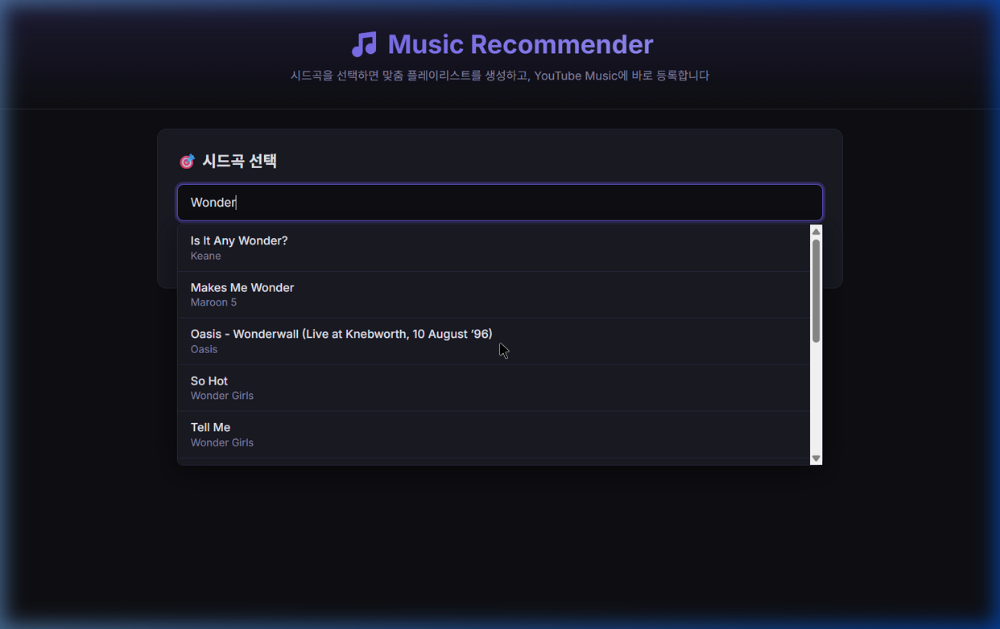

# 음원 생애주기 기반 음악 추천 알고리즘

> **"유튜브 뮤직은 좋아한 곡을 계속 틀어주지만, 질린 곡은 잘 걸러내지 못한다."**
> 
> 스포티파이/유튜브 뮤직의 추천 한계를 분석하고, **곡마다 '생애주기'를 추적하여 질림/재발견을 자동으로 감지하는** 개인화 추천 알고리즘을 설계했습니다.

---

## 프로젝트 요약

| 항목 | 내용 |
|------|------|
| **문제** | 기존 추천 시스템은 "많이 들은 곡 = 좋아하는 곡"으로 가정하여 이미 질린 곡을 반복 추천 |
| **접근** | 곡별 청취 패턴(스킵률 변화, 청취 빈도 추세)을 분석하여 '호감도'와 '모멘텀' 두 축의 연속 점수 부여 |
| **데이터** | 개인 YouTube Music 청취 기록 (~4,000곡, 12개월) |
| **핵심 기술** | Python, pandas, scikit-learn (K-Means), Last.fm API, TF-IDF 유사도 |

---

## 이 프로그램이 하는 일

```
1. 유저의 YouTube Music 청취 로그를 입력받음
2. 모든 곡에 대해 호감도(Affinity)와 모멘텀(Momentum) 점수를 산출
3. 곡 하나를 시드(seed)로 선택하면, 20곡 규모의 플레이리스트를 자동 생성

플레이리스트 구성 방식:
  - 호감도 기반 풀에서 가중 랜덤 샘플링 (점수 높을수록 뽑힐 확률 높지만 고정X)
  - 곡 분류별 비율 믹싱:
    · 현재 빠져있는 곡 (Rising/Steady)    ~40%
    · 좋아하지만 안 듣는 곡 (재발견 추천)  ~25%
    · 외부 신곡 발굴 (Last.fm 유사 아티스트)~20%
    · 완전 랜덤 (세렌디피티)              ~15%
  - 모드(preset)에 따라 비율 조절 가능:
    · 'comfort' → 익숙한 곡 비율↑, 외부 신곡↓
    · 'explore' → 외부 신곡↑, 재발견↑
    · 'default' → 균형
  - 장르 다양성 보정 + 시간대 맥락 반영
```

---

## 핵심 아이디어

### 기존 추천 시스템에서 느낀 한계

직접 스포티파이와 유튜브 뮤직을 사용하며 느낀 두 가지 불만 (사용자 체감 기반):

**문제 1: 곡에 대한 감정 변화가 추천에 잘 반영되지 않는 느낌** ← 이 프로젝트의 핵심 집중 영역

```
체감:
  한동안 반복해서 듣다가 슬슬 질린 곡인데, 여전히 추천 상위에 올라옴
  스킵을 여러 번 했는데도 비슷한 곡이 계속 재생됨
  "좋아요"를 직접 취소하지 않으면 추천이 바뀌지 않는 경우가 많음

→ 알고리즘을 직접 분석한 것은 아니지만,
  사용자의 행동 변화(스킵 증가, 재생 빈도 감소 등)가
  추천에 빠르게 반영되지 않는다는 체감이 이 프로젝트의 출발점
```

**문제 2: 신곡 추천의 배치가 어색할 때가 있다**

```
체감:
  잔잔한 인디 곡들을 듣고 있는데, 갑자기 분위기가 다른 곡이 끼어들 때가 있음
  → 곡 자체가 나쁜 건 아닌데, "지금 이 흐름에서?" 라는 느낌
  → 신곡을 넣는 것 자체보다, 플레이리스트의 어느 위치에 어떻게 넣느냐가 중요하다고 느낌
```

### 이 프로젝트의 접근

**문제 1에 집중**: 스킵 패턴의 변화 방향, 재생 빈도 추세, 아티스트 단위의 흐름 등 **행동 신호를 정밀하게 분석**하여 곡마다 "지금 이 사람이 이 곡을 어떻게 느끼는가"를 자동 추적

**문제 2는 부분적 접근**: 신곡 자체의 품질을 판단하기에는 1인 데이터의 한계가 명확하여, **어떤** 곡을 추천할지보다 **어디에 배치할지**에 집중. 익숙한 곡들 사이에 자연스럽게 1곡을 섞을지, 탐색 구간을 따로 만들지 등 플레이리스트 내 배치 전략을 설계. 오디오 피처(MFCC, 템포 등)는 librosa를 활용하여 추출하였으며 자체 개발은 아님.

### 해결: 2축 연속 점수 체계

단순한 재생 횟수 대신, **두 개의 독립적인 축**으로 곡을 평가합니다:

- **호감도 (Affinity, 0~1)**: "이 곡을 얼마나 좋아하는가?" — 천천히 변하는 장기 지표
  - 스킵 품질 (1 - 스킵률)
  - 궤적 (전반→후반 스킵률 변화 방향)
  - 재생 깊이 (log 정규화된 총 재생 횟수)
  - 능동성 (검색 후 재생 등 적극적 행동 비율)
  - 아티스트 인지율 (이 가수의 곡을 얼마나 많이 아는가)

- **모멘텀 (Momentum, 0~1)**: "요즘 이 곡을 듣고 있는가?" — 빠르게 변하는 단기 지표
  - 리센시 (마지막 재생으로부터의 경과일, 지수 감쇠)
  - 최근 빈도 (최근 30일 재생 횟수)
  - 아티스트 추세 (최근 4주 vs 전체 평균)
  - 가속도 (최근 30일 vs 이전 60일 비교 → "다시 듣기 시작한 곡" 포착)

```
호감도 높음 + 모멘텀 높음 → 지금 빠져있는 곡 (적극 추천)
호감도 높음 + 모멘텀 낮음 → 좋았지만 안 듣는 곡 (재발견 추천)
호감도 낮음 + 모멘텀 높음 → 최근 들어봤지만 별로 (추천 줄이기)
호감도 낮음 + 모멘텀 낮음 → 관심 없는 곡 (추천 제외)
```

---

## 시스템 아키텍처

```
YouTube Music 청취 로그
        │
        ▼
┌─────────────────────┐
│ Layer 0: 전처리      │  아티스트명 정규화 (Oasis/OasisVEVO → Oasis - Topic)
└─────────┬───────────┘
          ▼
┌─────────────────────┐
│ Layer 1: 아티스트 Tier│  K-Means 클러스터링 → S(생태계)/A(히트곡)/B(원히트) 분류
└─────────┬───────────┘
          ▼
┌─────────────────────┐
│ Layer 2: 곡별 점수    │  호감도(5개 신호) + 모멘텀(4개 신호) 연속 점수 산출
└─────────┬───────────┘
          ▼
┌─────────────────────┐
│ Layer 3: 비대칭 흐름  │  성장 Bottom-Up(곡→아티스트) / 쇠퇴 Top-Down(아티스트→곡) 감지
└─────────┬───────────┘
          ▼
┌─────────────────────┐
│ Layer 4: 플레이리스트 │  내부 재발굴 + 외부 신곡 발굴(Last.fm) 통합 믹싱
└─────────────────────┘
```

---

## 핵심 가설과 검증

### 가설 1: "스킵률의 변화 방향이 만족도를 반영한다"

```
전반기 스킵률 높음 → 후반기 스킵률 낮음: "듣다보니 좋아짐" (Zone 2)
전반기 스킵률 낮음 → 후반기 스킵률 높음: "좋다가 질림"    (Zone 3)
```

- 단순 스킵률(30%)보다 **스킵률의 변화 방향**이 사용자의 심리적 체감을 더 정확히 반영
- 이 발견을 호감도 점수의 `trajectory` 구성 요소로 반영

### 가설 2: "성장과 쇠퇴는 비대칭적으로 전파된다"

```
성장 (Bottom-Up): 잔나비의 곡 1개를 발견 → 잔나비의 다른 곡도 탐색
쇠퇴 (Top-Down):  잔나비 전체를 덜 듣게 됨 → 모든 곡이 함께 식음
```

- 성장은 곡 하나에서 시작하여 아티스트로 확대
- 쇠퇴는 아티스트 전체에서 시작하여 곡에 일괄 반영
- 이 비대칭 구조를 `AsymmetricFlowDetector` 클래스로 구현

---

## 프로젝트 구조

```
음악 프로젝트/
├── run.py                          # 통합 파이프라인 진입점
├── core/                           # 핵심 엔진 모듈
│   ├── lifecycle_recommender.py    # 메인 추천 알고리즘 (1,650줄)
│   ├── audio_features_engine.py    # MFCC 기반 오디오 피처 추출
│   ├── multi_signal_engine.py      # 다중 신호 통합 엔진
│   ├── nostalgia_engine.py         # 노스탤지어(추억곡) 감지 엔진
│   ├── external_discovery.py       # Last.fm 기반 외부 신곡 발굴
│   ├── tag_similarity.py           # TF-IDF 태그 유사도 계산
│   ├── lyrics_engine.py            # 가사 기반 매칭 엔진
│   ├── lastfm_client.py            # Last.fm API 클라이언트
│   ├── song_matcher.py             # 곡 제목 매칭 유틸리티
│   └── song_title_normalizer.py    # 곡 제목 정규화
├── analysis/                       # 탐색적 분석 스크립트
├── preprocessing/                  # 데이터 전처리
└── reports/                        # 분석 결과 리포트
```

### 핵심 클래스

| 클래스 | 역할 | 주요 로직 |
|--------|------|-----------|
| `ArtistTierClassifier` | 아티스트 등급 분류 | K-Means (곡 수, 재생 횟수, 최근 활동) |
| `SongScorer` | 곡별 연속 점수 산출 | 호감도 5요소 + 모멘텀 4요소 가중합 |
| `AsymmetricFlowDetector` | 성장/쇠퇴 감지 | Bottom-Up 성장, Top-Down 쇠퇴 (3단계 심각도) |
| `PlaylistGenerator` | 플레이리스트 생성 | 장르 다양성 + 시간대 맥락 + Discovery 믹싱 |

---

## 기술 스택

- **언어**: Python 3.10+
- **데이터 처리**: pandas, numpy
- **클러스터링**: scikit-learn (K-Means, StandardScaler)
- **유사도**: TF-IDF (sklearn), cosine similarity
- **오디오 분석**: librosa (MFCC, tempo, spectral features)
- **외부 API**: Last.fm API (유사 아티스트, 태그)
- **시각화**: matplotlib (분석 리포트)

---

## 웹 애플리케이션

위 알고리즘을 실제로 사용할 수 있는 웹 애플리케이션으로 구현했습니다.

### 주요 기능
- **시드곡 검색** → 내 청취 기록에서 곡을 검색하여 시드로 선택
- **플레이리스트 자동 생성** → 유사도 × 호감도 기반 25곡 추천
- **YouTube Music 연동** → 생성된 플레이리스트를 YouTube Music에 바로 등록

### 추천 공식
```
최종 점수 = 유사도(태그 25% + 오디오 58% + 메타 14% + 가사 3%)
           × 호감도(Affinity × 0.4 + Momentum × 0.6)
```

### 스크린샷

**메인 화면** — 시드곡 검색


**곡 검색** — 실시간 자동완성



**추천 결과** — 25곡 플레이리스트 + YouTube Music 매칭


---

## 실행 방법

```bash
# 의존성 설치
pip install pandas numpy scikit-learn librosa requests flask ytmusicapi

# 웹 앱 실행
python app.py
# → http://localhost:5000 에서 접속

# 또는 바탕화면 음악추천.bat 더블클릭
```

> **참고**: 개인 YouTube Music 청취 데이터는 개인정보 보호를 위해 포함되지 않았습니다.
> Google Takeout에서 YouTube Music 시청 기록을 다운로드하면 동일한 파이프라인을 실행할 수 있습니다.

---

## 결과 예시

```
아티스트 Tier 분류 결과
━━━━━━━━━━━━━━━━━━━━━━━━━━━━
Tier S (생태계 아티스트) — 8명
  Oasis              곡  42개 | 재생  520회
  JANNABI            곡  35개 | 재생  480회
  ...

호감도 TOP 10
━━━━━━━━━━━━━━━━━━━━━━━━━━━━
  주저하는 연인들에게           호감 0.87 | 모멘텀 0.45 | 처음부터 좋아함
  Champagne Supernova         호감 0.82 | 모멘텀 0.12 | 그냥저냥 ~

숨겨진 보석 (호감 높지만 요즘 안 듣는 곡) — 15곡
  Don't Look Back in Anger   호감 0.78 | 모멘텀 0.08 | 재발견 추천!
```

---

## 한계와 의의

### 한계

**1. 실제 만족도 검증 불가**
- 서비스로 배포하여 "이 플레이리스트가 실제로 좋았는가?"를 측정할 수 없음
- 현재는 정성적 검증(본인 청취 기록으로 직접 체감)에 의존
- → 이 한계를 극복하기 위해 [KKBox Kaggle 대회](../kaggle/kkbox)에 참가하여 대규모 데이터에서의 추천 성능을 정량적으로 검증함

**2. 대규모 예측에서 딥러닝 대비 한계**
- 이 알고리즘은 사람이 설계한 피처(스킵률, 재생 빈도 등)에 의존하는 규칙 기반 시스템
- KKBox 대회를 통해 확인한 것: 대량의 유저-곡 상호작용 데이터가 있으면 딥러닝(NCF, SASRec)이 사람이 만든 피처를 능가함
- 딥러닝은 "사람이 떠올리지 못하는 패턴"을 자동으로 학습하기 때문

**3. 1인 데이터의 편향**
- 본인의 청취 패턴에 최적화되어 있어 다른 유저에게 일반화되지 않을 수 있음

### 의의

그럼에도 이 접근법이 가지는 의의:

| 규칙 기반 (이 프로젝트) | 딥러닝 (NCF/SASRec) |
|--------------------------|----------------------|
| ✅ **해석 가능**: "이 곡은 스킵률이 후반에 올라가서 추천 순위가 낮다" 설명 가능 | ❌ 블랙박스 |
| ✅ **소량 데이터** OK: 1명의 로그로도 작동 | ❌ 대량 데이터 필요 |
| ✅ **도메인 지식 반영**: 비대칭 생애주기, 노스탤지어 등 음악 특유의 심리를 직접 설계 | ❌ 데이터에서만 학습 |
| ❌ 확장성 부족 | ✅ 수백만 유저 확장 가능 |
| ❌ 피처 설계가 병목 | ✅ 자동 피처 학습 |

**결론**: 이상적인 시스템은 **딥러닝의 자동 패턴 학습 + 규칙 기반의 해석 가능성**을 결합하는 것. 이 프로젝트는 그 중 규칙 기반 쪽의 극한을 탐구한 경험이며, 딥러닝을 학습한 뒤 두 접근법을 결합하는 것이 향후 목표.

---

## 향후 계획

- [ ] PyTorch 기반 NCF(Neural Collaborative Filtering) 모델 적용
- [ ] Transformer(SASRec) 기반 시퀀스 추천 실험
- [ ] 오디오 스펙트로그램 CNN 자동 피처 추출 파이프라인
- [ ] 규칙 기반 + 딥러닝 하이브리드 추천 시스템 설계

---

## 배운 것

이 프로젝트를 통해 다음을 경험했습니다:
- **가설 주도 개발**: "왜 추천이 잘 안 될까?" → 가설 → 데이터 검증 → 알고리즘 반영
- **피처 엔지니어링**: 단순 통계(재생 횟수)에서 행동 패턴(스킵률 변화 궤적)으로 진화
- **시스템 설계**: 레이어별 모듈화 (전처리 → 분류 → 점수 → 생성)
- **API 연동**: Last.fm API를 활용한 외부 데이터 통합
